# Unified dish ↔ condition database

> [!abstract] What it is
> A DuckDB database that links **dishes → ingredients → compounds → conditions** (symptoms and diseases), and back.
> It is built by `db/build.py` from 28 of the surveyed datasets. It answers two questions for the culturally aware
> medical-advice agent:
> - *what could this dish do to the body?*
> - *which dishes of this culture may help or aggravate this symptom, and which interact with the patient's drug?*
>
> Every link keeps its **source**, **evidence grade** and **direction**, so an answer can always show why it was
> given. Worked examples are in [[Traces - dish to symptom]] and [[Traces - symptom to dish]].

## Quick start
```bash
uv sync
uv run db/build.py --fresh                               # ~2 min → db/unified.duckdb (131 MB, git-ignored)
uv run db/trace.py dish "Timman Rice" --country SA --drug warfarin
uv run db/trace.py condition "nausea" --country IN
uv run db/trace.py sql "SELECT * FROM v_condition_dish WHERE condition_name = 'Cough' LIMIT 5"
```
- Build details and the contract between stages: `db/README.md`.
- Row counts, match rates and integrity checks, regenerated on every build: `db/build_report.md`.

## Coverage (build of 2026-09-30)
| | Count |
|---|---|
| Dishes | **46,253** from 9 sources (below), with 482,387 ingredient lines (97.8% matched to an ingredient, 62.8% with grams) and 43,516 lab-measured nutrient values |
| Ingredients | 1,688 canonical foods, spices and culinary herbs, with 11,005 aliases (en, zh, ja, pinyin, Latin, fa, ko, hi, ar) and 9,887 cross-references to herb and food databases |
| Compounds | 258,236 (merged on InChIKey > PubChem CID > cross-ids > CAS); 14,400 linked to CTD |
| Conditions | 24,585: MeSH/MEDIC diseases, 416 MeSH symptoms (C23.888), SymMap and HERB terms, 2,364 TCM symptoms, ICD-11 codes, 194 therapeutic "actions" |
| Links | ingredient→compound 248,796 · compound→condition 157,539 · ingredient→condition (direct) 64,779 · ingredient→drug 5,014 |
| Reach | 45,628 dishes (98.6%) reach at least one condition through a *characteristic* path (see Ranking), and 45,547 reach a symptom; 6,111 conditions are reachable |

| Dish source | Dishes | Culture labels |
|---|---|---|
| [[IndicRecipeNutri]] | 20,415 | India, by state (≤ 1,500 per region) |
| [[Food.com Recipes and Interactions]] | 10,095 | 21 countries from priority-region cuisine tags |
| [[CulinaryDB]] | 8,151 | Middle East, Indian subcontinent, China, Japan, Korea, Thailand, SE Asia |
| [[XiaChuFang Recipe Corpus]] | 5,000 | China (Chinese text) |
| [[Our Regional Cuisines (Japan MAFF)]] | 1,355 | Japan, by prefecture (Japanese text) |
| [[Indian Nutrient Databank (INDB)]] | 1,014 | India (lab-style nutrients) |
| [[Saudi Food Composition Tables]] | 130 | Saudi Arabia, 13 regions (lab nutrients) |
| [[Bahrain Food Composition Tables]] | 82 | Bahrain (nutrients only, no ingredient lines) |
| [[Kyrgyzstan Food Composition Table]] | 11 | Kyrgyzstan (lab nutrients) |

## Schema

```mermaid
erDiagram
  dish ||--o{ dish_ingredient : has
  dish ||--o{ dish_nutrient : "lab-measured"
  ingredient ||--o{ dish_ingredient : "matched to"
  ingredient ||--o{ ingredient_alias : ""
  ingredient ||--o{ ingredient_xref : ""
  ingredient ||--o{ ingredient_property : "Mizaj / TCM / use"
  ingredient ||--o{ ingredient_compound : contains
  compound ||--o{ ingredient_compound : ""
  compound ||--o{ compound_xref : ""
  compound ||--o{ dish_nutrient : "nutrient"
  compound ||--o{ compound_condition : "affects"
  condition ||--o{ compound_condition : ""
  ingredient ||--o{ ingredient_condition : "direct claim"
  condition ||--o{ ingredient_condition : ""
  condition ||--o{ condition_alias : ""
  condition ||--o{ condition_relation : "is_a / same_as / action_targets"
  ingredient ||--o{ ingredient_drug : "interacts"
  drug ||--o{ ingredient_drug : ""
  drug ||--o{ drug_condition : indication
```


| Table | Key columns | What it holds | Filled from |
|---|---|---|---|
| `dish` | `dish_id` (`<source>:<id>`), `name`, `name_local`, `lang`, `country_iso2`, `subregion`, `cuisine_label`, `steps_text`, `has_amounts` | one row per dish/recipe | the 9 dish sources above |
| `dish_ingredient` | `dish_id`, `ingredient_id`, `raw_text`, `quantity`, `unit`, `grams`, `match_method` (xref/exact/normalised/fuzzy/manual), `match_score` | recipe lines | same; matched via `db/maps/ingredient_map_manual.csv` (849 hand-translated zh/ja/en strings) |
| `dish_nutrient` | `dish_id`, `nutrient_compound_id`, `amount_per_100g`, `unit` | lab values of whole dishes | Saudi, Bahrain, Kyrgyz, INDB tables via `db/maps/nutrient_map.csv` |
| `ingredient` | `ingredient_id` (`ING:<slug>`), `canonical_name`, `category`, `scientific_name`, `ncbi_taxon_id`, `foodon_id`, `is_herb` | canonical foods and spices | IndicRecipeNutri KG, CulinaryDB/FlavorDB, FooDB foods |
| `ingredient_alias` / `ingredient_xref` | alias + `lang` + `alias_type`; `db` + `xref_id` | names in many languages; ids in ~20 databases (SymMap, HERB, TM-MC, IMPPAT, CMAUP, NPASS, DDID, SpiceRx, UNaProd, Duke, KNApSAcK, FooDB, USDA…) | all ingredient and herb sources |
| `ingredient_property` | `system`, `property`, `value` | the **cultural framing layer**: Persian Mizaj (hot/cold/wet/dry), TCM nature/flavour/meridian, edible vs medicinal use per country | [[UNaProd]], [[SymMap]]/[[HERB]], [[KNApSAcK Family]] |
| `compound` / `compound_xref` | `compound_id` (`IK:`/`CID:`/`MESH:`…), `inchikey`, `pubchem_cid`, `cas`, `mesh_id`, `is_nutrient` | merged chemicals | CTD, FooDB, HMDB, NPASS, CMAUP, IMPPAT, TM-MC, Phenol-Explorer, FlavorDB, HERB, SymMap |
| `ingredient_compound` | `amount`, `unit`, `mg_per_100g`, `plant_part`, `evidence_type`, `citation` | what a food contains | FooDB (no amount-less *predicted* rows), Phenol-Explorer, NPASS, CMAUP, IMPPAT, TM-MC, FlavorDB, HERB/SymMap |
| `condition` | `condition_id` (`MESH:`/`UMLS:`/`TCM:`/`ICD11:`/`ACT:`), `name`, `type` (symptom · disease · finding · tcm_symptom · tcm_syndrome · action), `mesh_id`, `umls_cui`, `icd11`, `hpo`, `mesh_tree` | symptoms and diseases | CTD MEDIC, SymMap, HERB, ICD-11 (CMAUP, DDID), `db/maps/action_map.csv` |
| `condition_alias` / `condition_relation` | 233k aliases (`lang='xref'` rows are ids); `is_a`, `same_as`, `action_targets` | names and hierarchy | same |
| `compound_condition` | `direction`, `evidence_type`, `pmids`, `score` | compound → condition | CTD curated (therapeutic → *beneficial*, marker/mechanism → *marker*), HMDB, Exposome-Explorer, FooDB/Duke activities |
| `ingredient_condition` | `direction`, `evidence_type`, `tradition`, `n_pos`, `n_neg`, `pmids`, `note` | direct food/herb → condition claims | SymMap (TCM), SpiceRx (±), CMAUP (ICD-11, trials), IMPPAT and Duke (traditional uses), UNaProd (Persian), HERB trials, KNApSAcK Jamu |
| `drug` / `drug_condition` / `ingredient_drug` | `effect` (Harmful · Negative · Positive · Possible · No Effect), `mechanism` (CYP…), `pmid` | food/herb–drug safety | [[DDID]] (+ [[DrugBank]] rows redistributed by DDID) |

### Views and derived tables (`db/views.sql`)
- `v_ingredient_condition_all`: every ingredient → condition path, either direct or via a compound. A path is
  only as strong as its weakest hop.
- `compound_profile`: in how many ingredients each compound occurs, and its richest source.
- `ingredient_condition_rollup`: one row per (ingredient, condition, direction), with the best evidence, the number
  of independent sources, and **salience**.
- `v_dish_condition` / `v_condition_dish`: dish-level aggregation. Always filter these by dish or condition, since
  unfiltered they are about 10⁸ rows.
- `nutrient_high_threshold`: the UK FSA "high" per-100 g thresholds (sodium 600 mg, salt 1.5 g, sugars 22.5 g,
  saturated fat 5 g, fat 17.5 g).

## Evidence grading and direction
| Rank | `evidence_type` | Examples |
|---|---|---|
| 1 | clinical | CMAUP plant–trial links, HERB curated trial conclusions |
| 2 | curated_literature | CTD curated chemical–disease; measured food composition; DDID rows with PMIDs |
| 3 | epidemiological | HMDB biomarkers, Exposome-Explorer cancer associations |
| 4 | traditional | IMPPAT uses, Duke ethnobotany and activities, SymMap herb→TCM symptom, UNaProd, Jamu |
| 5 | text_mined | SpiceRx (MEDLINE co-occurrence with ± polarity) |
| 6 | predicted | SymMap inferred herb–disease links, CMAUP target/transcriptome associations, DDID "Possible" without a PMID |

**Direction** is one of:
- **beneficial**: CTD *therapeutic*, a traditional use, or SpiceRx with more positive than negative papers;
- **harmful**: an action such as hypertensive or abortifacient, SpiceRx with more negative papers, or a DDID
  Harmful effect;
- **marker**: CTD *marker/mechanism*, or an HMDB biomarker;
- **association**: a trial or statistical link with no stated outcome.

Conflicting claims are kept side by side, not reconciled. For example, [[IMPPAT]] lists licorice as *beneficial* for
hypertension, while [[SpiceRx]] counts 12 positive / **57 negative** papers.

## Ranking
Without these rules, every dish reaches the same broad CTD terms (Neoplasms, Pain, Edema) through ubiquitous
compounds such as minerals and sugars.
- **Characteristic (salient) path.** A path counts if it is a direct ingredient → condition claim, or if it goes
  through a compound measured at ≥ 1 mg/100 g that is either **rare** (in ≤ 20 of ~935 ingredients) or of which this
  ingredient is a **major source** (≥ 10% of the richest source). This keeps curcumin in turmeric, piperine in black
  pepper, sodium in soy sauce and sugars in dates, and drops trace compounds and generic nutrients. A lab-measured
  dish nutrient counts only when it is above the FSA *high* threshold. `--all` shows every path.
- **Dish → conditions.** Conditions are ranked by the strongest single-ingredient support (the number of independent
  sources), then the best evidence grade, then the number of characteristic ingredients that agree.
- **Condition → dishes.** The condition is expanded to its narrower terms, its direct parents (traditional sources
  often say just "diabetes") and the actions aimed at it.
  - **Ingredient score** = independent sources + 2 if there is clinical/curated evidence + 1 if a direct claim exists.
  - **Dose-aware dish score** = Σ(ingredient score² × the ingredient's weight share of the dish). A ginger tea
    outranks a curry with a pinch of ginger.
  - Excluded: dishes with fewer than 4 lines (truncated records), and spice blends (≥ 75% spice lines; `--blends`
    shows them). Weights from IndicRecipeNutri's lowest-confidence tier (E), and spice weights above 30 g, count as
    unknown.

These rules are transparent heuristics, not validated scores; they order evidence for a human or an agent to read.

## Known limitations
- **Breadth of CTD.** CTD links are mostly lab and animal findings. *Therapeutic* means "studied as a treatment",
  not "proven in humans".
- **Traditional claims** are stored as the tradition states them, with the tradition named, and are not validated.
- **Compound merging.**
  - Stereo, tautomer and name variants share CTD MeSH ids (e.g. Demethoxycurcumin appears twice).
  - A few CAS-based merges inherited from FooDB are wrong (e.g. Sennoside A → Senna Extract).
  - Some names come from mislabelled FooDB records.
- **Quantities.**
  - Grams are approximate: volume units assume density 1, and pieces have no grams.
  - XiaChuFang and MAFF amounts are partly unparsed.
  - Some recipe records are truncated.
- **Partial sources.** SymMap, HERB, SpiceRx, UNaProd and KNApSAcK are local samples or scrapes (see their dataset
  notes). FooDB's content is 64% predicted; only rows with amounts are used. FoodAtlas, RecipeDB2, GRAYU and DrugBank
  are missing or partial until the [[Access requests]] are answered.
- **Missing mapping.** There is no local TCM-symptom → modern-symptom mapping. TCM symptoms connect to modern terms
  only through herb-level relations.
- **Licences.** Use in the agent is restricted: see [[Q3 Food compound & health-effect datasets#Licences & usage constraints]].
  In particular, [[GRAYU]] data is not used here, and CTD requires notification.
