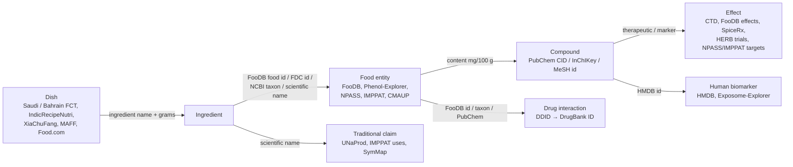

# Q3: Which datasets link foods and ingredients to chemical compounds, and those compounds to effects on the human body?

> [!summary] Short answer
> No single open dataset covers culture-labelled foods through to compounds and effects, so the agent has to chain several. For the **food → compound** hop, use [[FooDB]] (992 foods, 5.1 M content rows, amounts where measured) and [[Phenol-Explorer]] (458 foods × 501 polyphenols with literature means, e.g. curcumin 2,213.57 mg/100 g in dried turmeric). For plants outside FooDB, such as nigella, add [[NPASS]], [[CMAUP]] and [[IMPPAT]]. For the **compound → effect** hop, use [[CTD]] as the curated backbone (109,665 chemical–disease rows with PubMed ids). Add [[FooDB]] health-effect terms, [[SpiceRx]] for spice → disease links, and [[HERB]] for trial evidence. [[Exposome-Explorer]] supplies human cohort biomarkers, and [[HMDB]] serves as the identifier hub. For **safety**, add [[DDID]] (23,950 graded food/herb–drug interactions, open, including DrugBank's advice sentences). The ready-made food → chemical → disease graph [[FoodAtlas]] needs an API key, and several resources restrict use: [[GRAYU]]'s terms forbid medical advice, and [[CTD]] requires notification.

## Detailed answer

### 1. Food → compound (what is in the food, and how much)
- [[FooDB]] is the backbone. It has 992 foods, 70,477 compounds and 5,145,532 content rows, but only 16.6% of rows have a number and 64% are PathBank/HMDB *predictions*. Priority-region foods with rows: turmeric, date, fenugreek, cumin, saffron, cardamom, green/black tea, pomegranate, jujube, tamarind, hummus and couscous. Missing: **nigella, sumac, camel milk, za'atar, ghee, labneh**. Example amounts: turmeric → curcumin 2,507 mg/100 g; fenugreek → diosgenin 1,115 mg/100 g and trigonelline 130; date → pectic acid 2,310. Units are not normalised.
- [[Phenol-Explorer]] is the most reliable quantitative source for polyphenols: 458 foods × 501 polyphenols, 7,486 aggregated rows from 38,063 literature values with SD and PMIDs. Examples: dried turmeric → curcumin 2,213.57 mg/100 g (n = 14); curry powder → curcumin 285.26. Data on dates (56 rows), pomegranate (52) and 24 soy foods is also present. Human bioavailability studies are web-only.
- [[FoodAtlas]] is the only ready-made food → chemical → disease graph. It has 1,430 foods, 3,610 chemicals in foods and 48,474 "contains" edges with concentration, food part and processing, extracted by an LLM from 125,723 sentences (F1 0.67). **We could not get it**: it needs a free API key (NEEDS USER).
- [[NPASS]] 3.0 has 204,023 natural products from 48,940 organisms and 1.12 M organism–compound pairs. Its 208,415 quantitative composition records are web-only (we scraped 2,551). Example: thymoquinone is 22.6–42.4% of *Nigella sativa* oil, which fills FooDB's nigella gap.
- [[Dr. Duke's Phytochemical and Ethnobotanical Databases]] has 104,388 plant-part → chemical rows with ppm ranges (e.g. turmeric root curcuminoids 30,000–80,000 ppm). It is the source of 98.8% of FooDB's health effects.
- Presence-only plant chemistry, with no amounts: [[IMPPAT]] (196,220 plant-part–phytochemical links), [[CMAUP]] (412,761 plant–ingredient links), [[TM-MC]] (116,014 material–compound–PMID rows), [[HERB]] (44,595 ingredients), [[SymMap]] (26,035 ingredients), [[GRAYU]] (129,542 phytochemicals) and [[KNApSAcK Family]] Core (ginger → 635 metabolites).
- [[FlavorDB2]] covers 936 ingredients and 2,254 linked flavour molecules. They are sensory volatiles, and curcumin is missing from its turmeric list. [[HMDB]] tags 146,742 metabolites as coming from "Food" and links 74,427 to FooDB, but its plant-source tags are coarse and templated.

### 2. Compound → disease / target (what the compound does)
- [[CTD]] is the curated evidence layer. It has 109,665 DirectEvidence chemical–disease rows (10,744 chemicals × 3,326 diseases), labelled `therapeutic` or `marker/mechanism` with PMIDs, plus 1,329,897 human chemical–gene interactions. Examples: curcumin has 160 curated disease rows (156 therapeutic); EGCG has 77. Most of the underlying work is lab studies, so "therapeutic" does not mean a proven clinical benefit. Only 11,684 of 179,669 chemicals have a PubChem CID.
- [[FooDB]] health effects: 11,062 compound–effect links over 1,435 terms (curcumin has 115). They are qualitative, mostly Duke activities, and some are uses rather than effects on the body ("pesticide" 503, "flavor" 198).
- [[SpiceRx]] links 152 spices to 848 MeSH diseases through 8,957 text-mined associations with polarity and PMIDs, and joins its phytochemicals to CTD. Examples: turmeric → inflammation 60+/1−; fenugreek → diabetes 75/0.
- [[HERB]] 2.0 records 8,558 clinical trials and 8,032 meta-analyses of herbs, ingredients and foods. Curated conclusions exist for 1,941 trials; e.g. cinnamon HbA1c −0.83% (NCT00445354).
- [[CMAUP]] has 765,266 plant → ICD-11 disease associations based on targets, transcriptomics or trials, plus 28,871 ingredient–target activities. Its ingredient-trial evidence is very permissive.
- [[NPASS]] has 1,048,756 activity records (IC50/Ki/EC50) against 8,764 targets and 34,975 toxicity records. Curcumin alone has 1,264 activity rows.
- [[IMPPAT]] has 38,842 experimentally supported phytochemical–human-target links; curcumin has 194 target rows.
- [[GRAYU]] links plants to 13,480 diseases with an evidence type per edge. Turmeric → 104 diseases; cervical cancer is backed by 3 compound trials.
- [[SymMap]] maps herb → TCM symptom → modern symptom → disease, but its inferred disease links need filtering.
- [[TM-MC]] links compound → protein (581,190, STITCH) → disease (1,042,955, DisGeNET). All of these are predicted.
- [[Dr. Duke's Phytochemical and Ethnobotanical Databases]] has 28,929 chemical → activity rows, e.g. curcumin anti-inflammatory at 1,200 mg/man/day, and 1,627 toxicity/dose rows.
- [[KNApSAcK Family]] provides only traditional Jamu efficacy text. Its activity databases were not scraped.

### 3. Food–drug interactions (safety)
- [[DDID]] is the open, graded resource. It has 23,950 food/herb × drug records over 1,516 drugs, 270 foods and 1,068 herbs, with PK result, effect grade, target (CYP3A4, P-gp, OATP) and a PMID or label. 3,647 rows come from humans. It also redistributes DrugBank's 2,784 advice sentences. Examples: turmeric + tacrolimus is **Harmful** (PMID 28104136); liquorice + omeprazole is Negative (CYP3A4 induction); pomegranate + metformin; *Nigella sativa* + phenytoin (dog).
- [[DrugBank]] 6.0 has 2,475 drug–food interactions, but academic downloads were disabled on 2026-09-30. Use the DDID copy (525 drugs). It has no rows for turmeric, fenugreek, dates or pomegranate.
- [[FooDrugs]] is a high-recall literature index with 1,108,429 text-mined food–drug mentions (F1 0.77) and 2,434,671 transcriptomic CMap links with tau above 90 in absolute value. It has no grades. Its PMIDs join to DDID to upgrade a mention to a graded record.

### 4. Biomarkers (human evidence that the compound reaches the body)
- [[Exposome-Explorer]] (IARC) has 1,841 biomarkers, 8,898 food-intake ↔ biomarker correlations and 1,356 biomarker–cancer associations from prospective cohorts. The download has no effect sizes. East Asia is strong (JPHC Japan 87 cancer rows, Shanghai cohorts 100). Turmeric and dates have **no** rows.
- [[HMDB]] 5.0 has 217,920 metabolites and 27,670 metabolite–disease links. These are *biomarker* associations (altered levels in patients), not dietary effects. It is mainly the identifier hub (HMDB ↔ FooDB ↔ PubChem ↔ InChIKey).

## Comparison table
%% dataset · foods/compounds covered · compound→effect relations · evidence type · join keys · availability · accessed %%
Availability: open = bulk download · web = browse only · registration. Accessed: ✅ yes · partial 🟡 · ❌ no.

| dataset | foods / compounds covered | compound → effect relations | evidence type | join keys | availability | accessed |
|---|---|---|---|---|---|---|
| [[FooDB]] | 992 foods, 70,477 compounds, 5.1 M content rows | 11,062 compound → health-effect; 5,997 compounds → 1,744 enzymes | database-curated (Duke), 64% of content predicted | FooDB food/compound id, InChIKey, CAS, ChEBI, NCBI taxon | open | ✅ |
| [[Phenol-Explorer]] | 458 foods × 501 polyphenols | none (bioavailability on web) | literature means; human PK (web) | PubChem CID, ChEBI, scientific name | open | ✅ |
| [[FoodAtlas]] | 1,430 foods, 3,610 chemicals, 48,474 contains edges | 23,211 chemical → disease (13,417 treats / 9,794 worsens); 15,222 bioactivity | LLM extraction + CTD + assays + model predictions | FoodOn, FDC, NCBI taxon, PubChem, MeSH | registration | partial 🟡 |
| [[FlavorDB2]] | 936 ingredients, 25,595 molecules | none (flavour only) | curated presence | PubChem CID, FooDB id, CAS | web | partial 🟡 |
| [[NPASS]] | 204,023 NPs, 48,940 organisms | 1,048,756 activities; 34,975 toxicity; 208,415 amounts (web) | experimental, quantitative | InChIKey, PubChem, NCBI taxon, NPO/NPC | open | ✅ |
| [[CMAUP]] | 7,865 plants, 60,222 ingredients | 765,266 plant → ICD-11; 28,871 ingredient → target | target / transcriptome prediction; trial registries | PubChem, InChIKey, NCBI taxon, ICD-11, NPO | open | ✅ |
| [[Dr. Duke's Phytochemical and Ethnobotanical Databases]] | 2,315 plants × 24,771 chemicals (ppm) | 28,929 chemical → activity; 82,873 folk uses | mixed literature, ethnobotany | scientific name, chemical name, CAS | open | ✅ |
| [[KNApSAcK Family]] | Core 101,500 species–metabolite pairs (2012) | Jamu formula → efficacy | traditional claim | scientific name, CAS, C_ID | web | partial 🟡 |
| [[IMPPAT]] | 4,154 plants × 18,314 phytochemicals | 38,842 compound → target; 94,261 plant-part → use | traditional texts; in vitro | PubChem, InChIKey, HGNC/UniProt | open | ✅ |
| [[GRAYU]] | 12,743 plants × 129,542 phytochemicals | plant → 13,480 diseases; formulation → disease | trials, target overlap, texts | PubChem, InChIKey, MeSH/DOID/ICD-11 | web | partial 🟡 |
| [[HERB]] | 6,892 herbs × 44,595 ingredients | 8,558 trials; 8,032 meta-analyses; 15,515 targets | clinical registries + traditional + inferred | PubChem, InChIKey, NCT, UMLS | open | ✅ |
| [[SymMap]] | 698 herbs, 26,035 ingredients | herb → symptom → 14,086 diseases; 20,965 targets | expert-curated + statistical inference | PubChem, CAS, UMLS | open | ✅ |
| [[TM-MC]] | 649 materials, 23,948 compounds | 581,190 compound → protein; 1,042,955 protein → disease | literature presence; STITCH/DisGeNET predicted | InChIKey, CID, UMLS CUI | open | ✅ |
| [[SpiceRx]] | 188 spices, 866 phytochemicals | 8,957 spice → disease (8,172 + / 783 −) | text-mined MEDLINE | NCBI taxon, PubChem, MeSH | web | partial 🟡 |
| [[CTD]] | 179,669 chemicals | 109,665 curated chemical → disease; 1,329,897 human chemical → gene | manual curation, mostly lab | MeSH, CAS, PubChem, InChIKey | open | partial 🟡 |
| [[HMDB]] | 217,920 metabolites (74,427 → FooDB) | 27,670 metabolite → disease | clinical metabolomics (biomarker) | HMDB id, FooDB id, PubChem, InChIKey | open (browser only) | ✅ |
| [[Exposome-Explorer]] | 1,841 biomarkers | 8,898 intake correlations; 1,356 biomarker → cancer | human cohorts, feeding studies | PubChem, InChIKey, HMDB, FooDB | open | ✅ |
| [[DDID]] | 270 foods, 1,068 herbs, 1,516 drugs | 23,950 graded food/herb → drug interactions | human PK, animal, drug labels | DrugBank ID, PubChem, InChIKey, FooDB id, NCBI taxon | open | ✅ |
| [[DrugBank]] | 11,891 drugs | 2,475 drug–food advice sentences | curator statements | DrugBank ID, PubChem, InChIKey | registration | partial 🟡 |
| [[FooDrugs]] | 1,108,429 food–drug mentions | evidence spans; CMap similarity | text mining; transcriptomics | PMID, NCT, DrugBank ID | open | ✅ |

## How to chain food → ingredient → compound → effect

**Join keys, step by step**
1. **Dish → ingredient** comes from recipe datasets: the [[Saudi Food Composition Tables]] and [[Bahrain Food Composition Tables]] (grams per recipe), [[IndicRecipeNutri]] (estimated grams), [[Kyrgyzstan Food Composition Table]], [[Our Regional Cuisines (Japan MAFF)]] and [[XiaChuFang Recipe Corpus]]. The key is the ingredient name, which needs normalisation. Only IndicRecipeNutri (FoodOn, PubChem) and [[RecipeDB2]] (USDA `ndb_id`) ship ids.
2. **Ingredient → food entity** uses FooDB food id (`FOOD#####`), USDA FDC id / FoodOn, NCBI taxon or scientific name. The Korean, Japanese and Kyrgyz FCTs carry scientific names; [[CulinaryDB]] uses FlavorDB entity ids; [[DDID]] carries FooDB id and NCBI taxon.
3. **Food → compound** uses PubChem CID, InChIKey, FooDB compound id (`FDB######`) or MeSH chemical id (CTD, FoodAtlas). Resolve by InChIKey where you can: CTD has CIDs for only 11,684 chemicals, and the vault notes record curcumin as CID 969516 in SpiceRx, IMPPAT, HMDB and Phenol-Explorer but as CID 5281767 in CMAUP.
4. **Compound → effect** goes through [[CTD]] (MeSH / CID / InChIKey), FooDB `CompoundsHealthEffect`, [[SpiceRx]] (taxon → MeSH disease), [[HERB]] (InChIKey → trials) and [[HMDB]]/[[Exposome-Explorer]] (HMDB id).
5. **Safety** goes through [[DDID]]: food via `FoodB_ID`, `Taxonomy_ID` or scientific name, then drug via `DrugBank_ID` → [[DrugBank]].

**Worked example (GCC): Gulf machboos/kabsa → turmeric → curcumin → effects and safety**

| step | source | row (numbers from the dataset notes) |
|---|---|---|
| dish → ingredient | [[Bahrain Food Composition Tables]] annex | Machboos dajaj: 500 g rice, 100 g chicken, **5 g turmeric**, 10 g dry lemon, 15 g spices… (its Saudi counterpart is kabsa in [[Saudi Food Composition Tables]]) |
| cultural confirmation | [[Food.com Recipes and Interactions]], [[BLEnD]] | Turmeric appears in 12.7% of `saudi-arabian` recipes, and Saudi annotators name turmeric among the most common spices |
| ingredient → food id | [[FooDB]], [[USDA FoodData Central]], [[SpiceRx]], [[CMAUP]] | FooDB FOOD00068 *Curcuma longa*; FDC 172231 "Spices, turmeric, ground" (no curcuminoids); NCBI taxon 136217; CMAUP/NPASS `NPO24124` |
| food → compound (amount) | [[Phenol-Explorer]], [[FooDB]] | Curcumin 2,213.57 mg/100 g in dried turmeric (Phenol-Explorer); 2,507 mg/100 g (FooDB FDB012292). Our own arithmetic: 5 g turmeric ≈ 110 mg curcumin per pot |
| compound id | [[HMDB]], [[CTD]] | HMDB0002269, PubChem 969516, MeSH D003474 |
| compound → effect (curated) | [[CTD]] | 160 curated disease rows (156 therapeutic), e.g. type 2 diabetes `therapeutic` (PMID 18403477), Alzheimer disease (PMID 15590663) |
| compound → effect (other layers) | [[FooDB]], [[SpiceRx]], [[NPASS]], [[IMPPAT]] | 115 FooDB effect terms (anti-inflammatory, COX-2 inhibitor…); turmeric → inflammation 60+/1−; COX-2 IC50 11,060 nM; 194 human-target rows |
| human biomarker | [[Exposome-Explorer]], [[HMDB]] | No turmeric or curcumin rows in Exposome-Explorer. HMDB has only a faecal biomarker link to colorectal cancer |
| safety | [[DDID]], [[FooDrugs]], [[DrugBank]] | Turmeric + tacrolimus **Harmful** (oedema, creatinine up to 4.2 mg/dL; PMID 28104136); turmeric in an anticoagulation case with INR up to 6.5 (PMID 25230280); DrugBank has no turmeric food-interaction row, but its curcumin card DB11672 lists P-gp (ABCB1) |

The agent's message would be: "Machboos uses about 5 g turmeric, a curcumin source with mostly lab evidence for anti-inflammatory effects. If you take tacrolimus or an anticoagulant, check with your doctor." The same pattern works for East Asia with green tea → EGCG. Exposome-Explorer links EGCG (PubChem 65064) to breast and gastric cancer in the JPHC cohort, and CTD records EGCG → breast neoplasms `therapeutic` (PMID 10518005).

## Priority regions
All compound and effect databases are **global and have no culture labels**. Regional relevance comes from which regional foods they contain and where their evidence was produced.

| region | what exists | best source |
|---|---|---|
| **GCC** | Staples covered in FooDB/Phenol-Explorer: dates, cardamom, saffron and turmeric. Camel milk and nigella are missing from FooDB. DDID has dates, black seed and fenugreek. Exposome-Explorer has only Kuwait (22 pollutant rows). HERB has 49 meta-analyses from Saudi Arabia. | [[FooDB]] + [[CTD]] + [[DDID]] |
| **Levant / Iran / Turkey** | Sumac and golpar are in [[SpiceRx]], not FooDB. Exposome-Explorer has Iran (Golestan, 138 rows) and Turkey 12. HERB has 577 meta-analyses from Iran. Persian claims are in [[UNaProd]] ([[Q2 Cultural ingredient datasets\|Q2]]). | [[SpiceRx]] + [[CTD]] |
| **Central Asia** | No regional evidence: Exposome-Explorer has no Central Asian rows, and NPASS has only 28 organism–compound pairs collected in Uzbekistan. Kyrgyz foods (sea buckthorn, barberry) join via scientific name to [[FooDB]] / [[Phenol-Explorer]]. | [[FooDB]] + [[Phenol-Explorer]] |
| **South Asia** | [[IMPPAT]] and [[GRAYU]] link Indian plants to compounds, targets and diseases. The SpiceRx spice list is South Asia-oriented. Exposome-Explorer has only 26 Indian pollutant rows. | [[IMPPAT]] + [[SpiceRx]] |
| **East Asia** | [[HERB]], [[SymMap]] and [[TM-MC]] cover the herbs. DDID's herb layer is TCM. Exposome-Explorer is strong: Japan 2,351 and China 2,000 rows, including JPHC and Shanghai cancer cohorts. | [[HERB]] + [[Exposome-Explorer]] |
| **Southeast Asia** | Jamu efficacy ([[KNApSAcK Family]]). Exposome-Explorer: Singapore 11 colorectal-cancer rows, and small counts for Thailand, Vietnam and Malaysia. | [[KNApSAcK Family]] + [[FooDB]] |

## Licences & usage constraints
These constraints are recorded in the dataset notes and apply to all three questions. **Several resources may not be served directly to users of a medical-advice agent, or merged and redistributed.**

> [!warning] Constraints that affect the agent directly
> - [[GRAYU]]: its Terms of Use allow non-commercial research and education only. They forbid bulk copying, large-scale scraping and mirroring, and they forbid using the service **"to provide medical advice"**. Use it for research on the agent, not as served content. Bulk or API access needs an agreement (mini@ncbs.res.in).
> - [[NII Cookpad Dataset]]: academic research only, under an institutional contract signed with an official seal. Feeding the data to an **external generative-AI service counts as prohibited third-party disclosure**, unless the service guarantees no training on inputs. Cookpad must be notified 30 days before publication, and an annual usage report is required.
> - [[World Wide Dishes]]: CC-BY-4.0 plus terms of use. It is for evaluation, and it **may not be used to build prompt templates that generate training data** or to generate images for training.
> - [[CTD]]: free for non-commercial use if you cite CTD, link back to it and **notify CTD** of the use. Commercial use needs a licence. [[FoodAtlas]] does not redistribute CTD edges for this reason, so they must be rebuilt locally.
> - [[IMPPAT]] and [[KNApSAcK Family]]: **CC BY-NC-ND 4.0**, so no derivatives. A merged or modified knowledge graph needs permission. KNApSAcK also asks for a citation of Afendi 2012 and the URL.

| constraint | datasets |
|---|---|
| Non-commercial (CC BY-NC 4.0) | [[FooDB]], [[DrugBank]] (full DB; its vocabulary and open structures are CC0) |
| Non-commercial with citation (site terms) | [[HMDB]], [[Phenol-Explorer]] |
| Non-commercial share-alike | CC BY-NC-SA 3.0: [[FlavorDB2]], [[CulinaryDB]], [[SpiceRx]]. CC BY-NC-SA 4.0: [[ArabCulture]], [[IndicRecipeNutri]] (recipe prose withheld; rehydrate from source URLs) |
| Share-alike | CC BY-SA 4.0: [[BLEnD]], [[WorldCuisines]] (images under their own Wikimedia licences) |
| Open (CC BY 4.0 / CC0) | [[FooDrugs]] (CC BY 4.0, but its DrugBank and drugs.com documents are proprietary label text: check before redistributing); [[Kyrgyzstan Food Composition Table]] (CC BY 4.0 on figshare, while the PDF says no commercial use without permission); [[USDA FoodData Central]] and [[Dr. Duke's Phytochemical and Ethnobotanical Databases]] (CC0) |
| Government terms | [[Korean Food Composition Table]]: KOGL Type 1 for the Excel file, Type 2 (non-commercial) for the book PDF. [[Standard Tables of Food Composition in Japan]]: free with the citation 「日本食品標準成分表（八訂）増補2023年から引用」. [[Saudi Food Composition Tables]], [[Bahrain Food Composition Tables]]: not stated (government publications). [[Our Regional Cuisines (Japan MAFF)]]: Apache-2.0 claimed by the third-party uploader; MAFF's terms apply to the content |
| Copyright or unclear | [[Exposome-Explorer]] (© IARC/WHO, no open licence, redistribution unclear); [[Food.com Recipes and Interactions]] ("© original authors"); [[XiaChuFang Recipe Corpus]] (no commercial use, per the paper) |
| Not released / gated | [[RecipeDB2]] (institutional copyright; contact the authors); [[FoodAtlas]] (Apache-2.0, but needs an API key); [[ArSyra Food and Culture]] (commercial; the README forbids redistribution) |
| Licence not stated | [[CMAUP]], [[NPASS]], [[HERB]], [[TM-MC]], [[DDID]], [[SymMap]] (v1 paper CC BY-NC), [[UNaProd]] (paper says free "with no restriction"), [[Indian Nutrient Databank (INDB)]] (IFCT source restricted), [[FmLAMA]] (derived from CC0 Wikidata) |
| Distribution status unclear | [[Central Asian Digital Visual Food Atlas]] (no licence; the PDF was removed from the repo head, so ask the authors before redistributing); [[Central Asian Food Dataset]] (conflicting licences: MIT vs CC BY-NC 4.0 for CAFD) |

## Unified database
The chain above is implemented as a DuckDB database that links 46,253 dishes → 1,688 ingredients → 258k compounds →
24.6k conditions, with 5,014 food–drug interactions: see [[Unified database]]. Worked examples in both directions
(e.g. Saudi Timman Rice → curcumin/piperine → CTD; nausea → ginger → dishes by country; hypertension → soy sauce and
miso sodium in Japan, licorice's conflicting evidence) are in [[Traces - dish to symptom]] and
[[Traces - symptom to dish]].

## Gaps & open questions
- **No open, culture-labelled food → compound → effect graph exists.** [[FoodAtlas]] comes closest but needs an API key (NEEDS USER), and it has no culture labels.
- **FooDB lacks nigella, sumac, camel milk, za'atar, ghee and labneh.** Thymoquinone (FDB013274) is linked only to winter savory. Use [[NPASS]] (web composition) or [[Dr. Duke's Phytochemical and Ethnobotanical Databases]] for nigella; camel milk has no compound source in the vault.
- **Amounts are the weak link.** Only 16.6% of FooDB content rows are quantified. CMAUP, IMPPAT, TM-MC and HERB are presence-only, and NPASS amounts are web-only (we have 2,551 rows).
- **Human evidence is thin for priority-region foods.** Exposome-Explorer has no rows for turmeric, curcumin or dates, no GCC country except Kuwait, no Central Asia, and no effect sizes in the download. CTD's evidence is mostly lab-based, and dose is not recorded anywhere except Duke activity doses and HERB trial conclusions.
- **Drug-interaction coverage is patchy.** DrugBank has no turmeric, fenugreek, date or pomegranate rows, and its downloads were disabled. DDID is 75% "Possible", mostly animal rows, so filter to `Homo Sapiens` and {Positive, Negative, Harmful}.
- **Identifiers are messy.** Curcumin has two CIDs across the vault notes, CTD has few CIDs, and DDID food names are not normalised. The agent needs an InChIKey-first resolver.
- **Access blockers:** FooDB and HMDB need manual browser downloads (Cloudflare). GRAYU bulk access needs an email. SpiceRx (29 of 188 spices), FlavorDB2 (48 ingredients) and SymMap relations (8 herbs) are partial crawls.
- Open: will CTD notification and GRAYU's no-medical-advice clause be acceptable for a deployed agent, or should these only be used offline to build evidence summaries?

## Datasets
![[Datasets.base#This question]]

## Papers
![[Papers.base#This question]]
